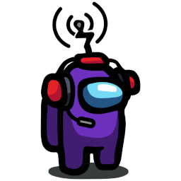

# BetterCrewLink Server - Go Rewrite

[![License][license-shield]][license-url] [![Docker Pulls][docker-shield]][docker-url] [![Run on Repl.it][replit-shield]][replit-url] [![Discord Server][discord-shield]][discord-url]

<br />
<p align="center">
  <a href="https://github.com/OhMyGuus/BetterCrewLink-server">
    
  </a>
  <h3 align="center">BetterCrewLink Server</h3>
  <p align="center">
    Voice Relay server for <a href="https://github.com/OhMyGuus/BetterCrewLink">BetterCrewLink</a>.
    <br />
    <a href="https://github.com/OhMyGuus/BetterCrewLink-server/issues">Report Bug</a>
    ·
    <a href="https://github.com/OhMyGuus/BetterCrewLink-server/issues">Request Feature</a>
  </p>
</p>
<hr />

<!-- NOTES -->
<b>Notes:</b><br />
- This is the Go rewrite of the BetterCrewLink server, fully compatible with the original TypeScript client.
- The server is optimized for performance and stability using Go's concurrency model.

<!-- SETUP -->
## Quick Start

### Prerequisites
- Go 1.21 or later
- [BetterCrewLink client](https://github.com/OhMyGuus/BetterCrewLink/releases)

### Installation
```sh
git clone https://github.com/OhMyGuus/BetterCrewLink-server.git
cd BetterCrewLink-server
go build -o server .
./server
```

### Using Docker Compose
```sh
docker-compose up -d
```

### Configuration
Copy `config/peerConfig.example.yml` to `config/peerConfig.yml` and customize as needed.
Set the `HOSTNAME` environment variable to use the built-in TURN server.

<!-- ENVIRONMENT -->
## Environment Variables
- `PORT` - Server port (default: `9736`, or `443` if TURN is enabled)
- `HOSTNAME` - Hostname for the TURN server (required if `integratedRelay.enabled` is true)
- `NAME` - Server name displayed in the UI
- `HTTPS` - Enable HTTPS mode (requires `privkey.pem` and `fullchain.pem`)

<!-- DEPLOY -->
## Deploy to Heroku
[](https://heroku.com/deploy)

## Deploy to Repl.it
[](https://repl.it/github/OhMyGuus/BetterCrewLink-server)

## CI/CD
This project uses GitHub Actions for automatic building, testing, and deployment. On every push to `main` or `master`, the workflow will:
- Build the Go binary
- Run `go vet` and tests
- Build a Docker image and push to GitHub Container Registry
- Create a release when a tag `v*` is pushed

The workflow is defined in `.github/workflows/build.yml`.

<!-- FEATURES -->
## Features
- Full Socket.IO v2 protocol compatibility with BetterCrewLink clients
- Built-in TURN/STUN relay server for NAT traversal
- Lobby browser system
- Voice activity detection (VAD) relay
- Web signaling and peer configuration
- Optimized Go runtime for low-latency voice relay
- Beautified mobile-friendly server homepage

<!-- CONTRIBUTING -->
## Contributing
Contributions are welcome! Please open an issue or pull request.

## License
Distributed under the GNU General Public License v3.0. See [LICENSE](LICENSE) for more information.

[license-shield]: https://img.shields.io/github/license/OhMyGuus/BetterCrewLink-server?label=License
[license-url]: https://github.com/OhMyGuus/BetterCrewLink-server/blob/master/LICENSE
[docker-shield]: https://img.shields.io/docker/pulls/ohmyguus/bettercrewlink-server?label=Docker%20Pulls
[docker-url]: https://hub.docker.com/r/ohmyguus/bettercrewlink-server
[replit-shield]: https://repl.it/badge/github/OhMyGuus/BetterCrewLink-server
[replit-url]: https://repl.it/github/OhMyGuus/BetterCrewLink-server
[discord-shield]: https://img.shields.io/discord/791516611143270410?color=cornflowerblue&label=Discord&logo=Discord&logoColor=white
[discord-url]: https://discord.gg/qDqTzvj4SH
